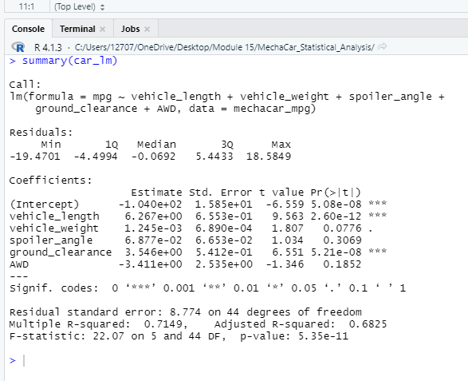
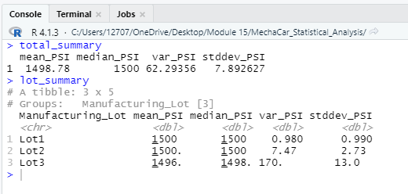
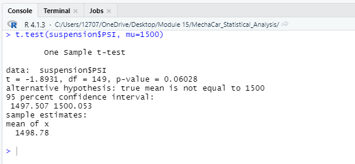
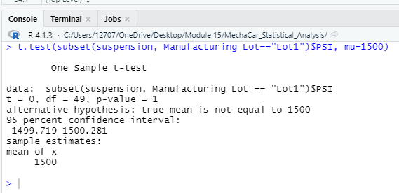
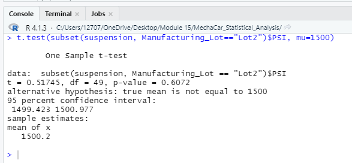
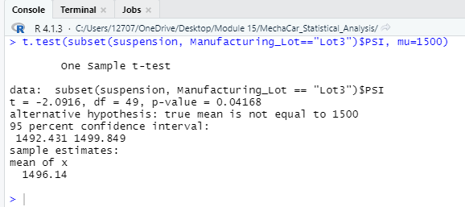

# MechaCar_Statistical_Analysis

## Challenge Overview
### Overview of the MechaCar Statistical Analysis
The purpose of this challenge was to use statistics and hypothesis testing in R to analyze datasets for automobile manufacturing.

## Linear Regression to Predict MPG

A linear regression was run to determine which variables in the dataset predict MPG.

- Which variables/coefficients provided a non-random amount of variance to the mpg values in the dataset?
    - Vehicle length, ground clearance and the intercept provided a non-random amount of variance.
- Is the slope of the linear model considered to be zero? Why or why not?
    - The intercept value is -1.04e+02 (-104), which is nonzero.
- Does this linear model predict mpg of MechaCar prototypes effectively? Why or why not?
    - The R-squared value is 0.6825, which means 68.25% of the variations in mpg can be explained by changes in the 5 variables found in the dataset. We can conclude that the linear model does a good job at predicting mpg of MechaCar prototypes.

## Summary Statistics on Suspension Coils

The design specifications for the MechaCar suspension coils dictate that the variance of the suspension coils must not exceed 100 pounds per square inch.
The overall variance in PSI for all manufacturing lots is 62.29, which is under the 100 PSI variance requirement.
The variance in PSI for lots 1, 2, and 3 are .980, 7.47, and 170 respectively.  Lots 1 and 2 meet the 100 PSI variance requirement, but lot 3 does not at 170.

## T-Tests on Suspension Coils

For the following tests, a significance level of .05 is assumed.

For all manufacturing lots, the p-value is .06, indicating that we do not have sufficient evidence to reject the null hypothesis, and we can conclude that all lots as a whole are not statistically different from the population mean of 1,500 PSI.  

For Lot 1, the p-value is 1, indicating that the mean is 1,500 and not statistically different from the population mean.

For Lot 2, the p-value is .6072, indicating that the mean is not statistically different from the population mean.

For Lot 3, the p-value is .04, indicating that we can conclude that we can reject the null hypothesis and conclude that the mean is significantly different from 1,500 PSI.

## Study Design: MechaCar vs Competition

### Metric to test

We could test the highway fuel efficiency from MechaCar vehicles compared to other vehicles on the market.

### Null and Alternate Hypothesis

The null hypothesis would be that MechaCar's average highway fuel efficiency is the same or similar to competitor's vehicles. 
The alternative hypothesis would be that MechaCar's average highway fuel efficiency is different (larger or smaller) than other competitor's vehicles.

### Statistical Test to Use

The best test to use for this analysis would be two-sample t-tests.

### Data Needed 

We would need to gather fuel economy data on vehicles from MechaCar vehicles, as well as all other major vehicle competitors.